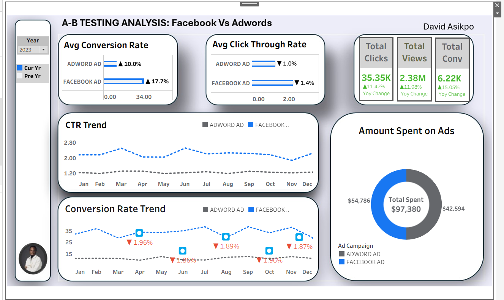

# A/B Test Dashboard – Ad Campaign Analysis

## Project Overview
This project presents an **interactive dashboard** for analyzing online advertising campaigns.  
It compares campaigns (e.g., **Facebook Ads** vs **AdWords Ads**) across key metrics such as **Click-Through Rate (CTR)**, **Conversion Rate**, and **Cost Per Click**, identifying statistically significant differences using **A/B testing methodology**.  

The primary goal is to provide **actionable insights** into campaign performance and support **data-driven decision-making** for ad spend optimization.

---

## Data Source

| Column | Description |
|--------|-------------|
| `date_of_campaign` | Date when the campaign was run |
| `Ad Campaign` | Campaign source (Facebook, AdWords) |
| `Ad Views` | Number of ad impressions |
| `Ad Clicks` | Number of ad clicks |
| `Ad Conversions` | Number of successful conversions |
| `Cost Per Ad` | Daily ad spend |
| `Ctr` | Click-through rate (%) |
| `Conversion Rate` | Conversion rate (%) |
| `Cost per Click` | Cost per individual click |

---

## Workflow

### 1. Data Cleaning
- Checked for **missing values and duplicates**, ensuring each row represented a **single session per campaign**.  
- Standardized column names and **merged multiple campaign datasets** into one, which also **facilitated statistical testing** later.  

### 2. Data Aggregation / Feature Engineering
- Created **key derived columns** from raw campaign data:  
  - `CTR` = Clicks ÷ Views  
  - `Conversion Rate` = Conversions ÷ Clicks  
  - `Cost per Click` = Cost ÷ Clicks  
- This ensures the dashboard reflects **accurate performance metrics**.  

### 3. Statistical Analysis (A/B Test)
- **CTR & Conversion Rate**: compared using **two-sample proportion Z-test**  
  - Z-test was chosen because **CTR and Conversion Rate are proportions**, derived from clicks and views, which follow a **binomial/Bernoulli process**.  
  - It allows for **testing differences in proportions** between campaigns with large sample sizes.  
- **Continuous metrics** (e.g., Cost per Click) compared using **Welch’s t-test**.  
- **Hypotheses:**  
  - **Null (H₀):** No difference between campaigns  
  - **Alternative (H₁):** Campaigns differ  

### 4. Results Interpretation
- Example outcome:  
  - **CTR Z-statistic = -79.33**, **P-value = 0.0 → highly significant**  
  - Indicates that differences in CTR between campaigns are **not random or due to chance**.  
- Determined the **top-performing campaign** based on CTR.  
- Calculated **effect sizes** to quantify differences for **actionable business insights**.  

### 5. Dashboard Development
- Built using **Tableau**.  
- Features include:  
  - Monthly CTR and Conversion Rate trends to detect **declines or improvements** relative to the previous year  
  - Average CTR and Conversion Rate by year, with **percentage changes** from the previous year  
  - Yearly **Cost of Ads per campaign**  
  - Key KPIs such as **Total Views, Total Clicks, Total Conversions**, with **year-over-year percentage change**  

### 6. Insights & Recommendations
- Highlights **top-performing campaigns** per metric  
- Provides **actionable recommendations** to optimize ad spend  
- Dashboard **updates dynamically** as new campaign data is added  

---

## Dashboard Preview

Below is a screenshot of the interactive dashboard for this project:  

> This visualization showcases trends, key metrics, and year-over-year performance comparisons for Facebook and AdWords campaigns.

---

## Why Z-test Was Used
CTR and Conversion Rate are **proportional metrics**, calculated as a ratio of clicks to views or conversions to clicks. Since these are **binomial in nature**, a **two-sample proportion Z-test** is statistically appropriate for testing whether the observed differences between campaigns are **significant and not due to random chance**.

---

## Next Steps / Future Improvements
- Segment analysis by **device type, region, or audience demographics**  
- Add **forecasting** for expected CTR and Conversion Rate trends  
- Implement **alerts** for campaigns with unusually low CTR or high cost per click

## Link to Dashbaord: https://public.tableau.com/views/ADCampaignAnalysis/Dashboard1?:language=en-US&:sid=&:redirect=auth&:display_count=n&:origin=viz_share_link
